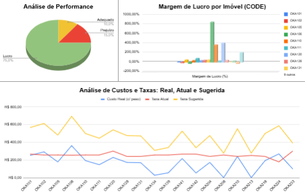

## Descrição do Projeto

Este projeto, realizado como parte de um desafio técnico (empresa omitida) durante um processo seletivo de Trainee, demonstra minhas habilidades em análise crítica e resolução de problemas. O desafio requeria a avaliação do método de cálculo da taxa de limpeza de imóveis, a reformulação desse cálculo com base em dados fornecidos e a proposição de um modelo otimizado para garantir a adequação aos custos e a justiça da taxa.

## Objetivo

Avaliar a habilidade analítica, o pensamento crítico, a proatividade na resolução de problemas e
a habilidade com planilhas do candidato, visando otimizar o processo de definição da taxa de
limpeza dos imóveis da EMPRESA.

## Contexto

A taxa de limpeza é uma taxa cobrada pela EMPRESA para cobrir os custos de limpeza do imóvel
após a estadia de um hóspede. Essa taxa é separada do preço da estadia e é adicionada ao
custo total da reserva.

## O que a taxa de limpeza cobre:

● Limpeza geral do imóvel, incluindo banheiros, cozinha, quartos e áreas comuns.

● Lavagem de roupa de cama e toalhas.

● Reposição de Amenities.

● Material de limpeza.

## Tecnologias Utilizadas
* Google Sheets

## Contato

 
 

## Link para o Portfolio

